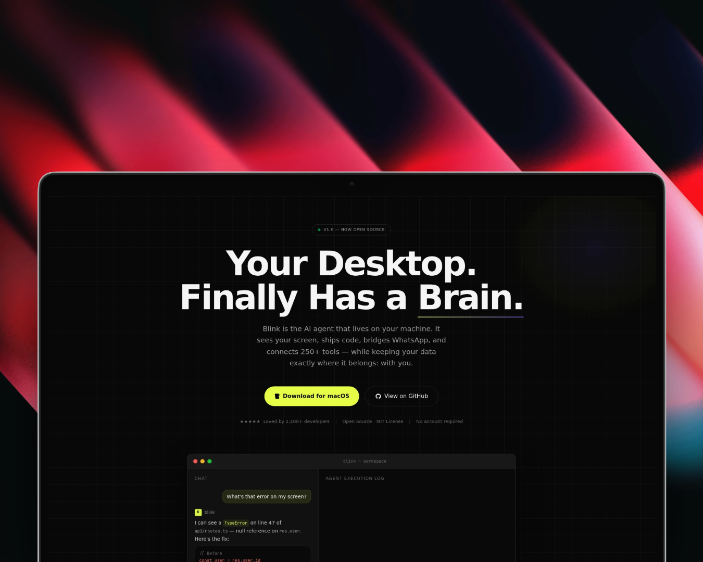
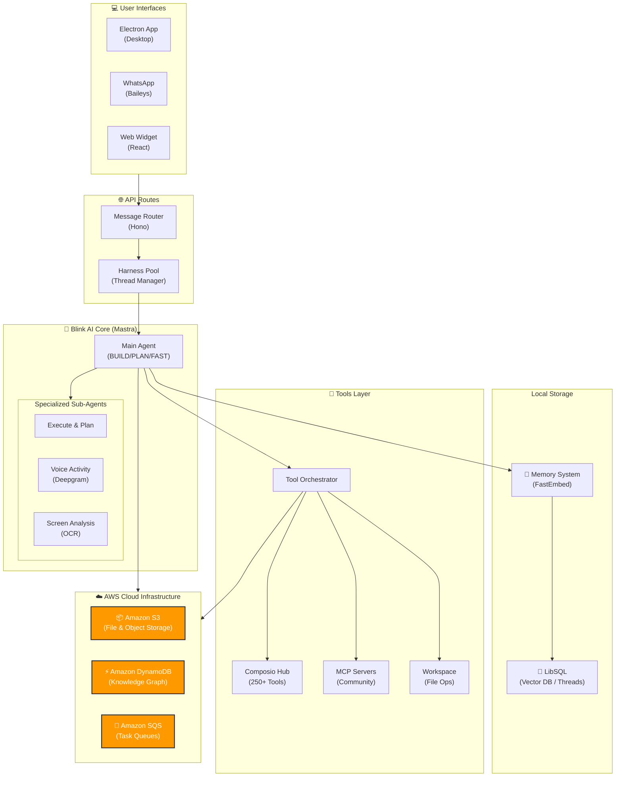
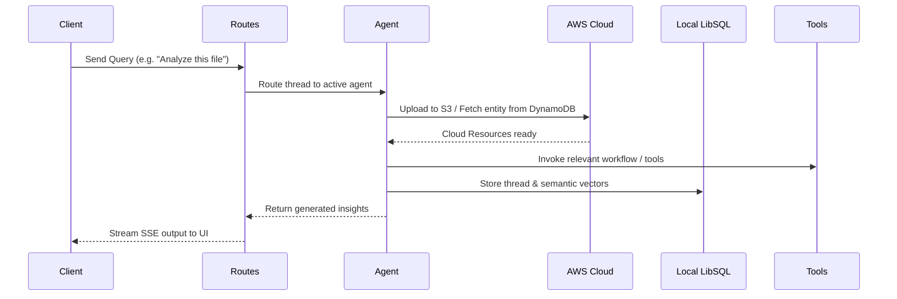
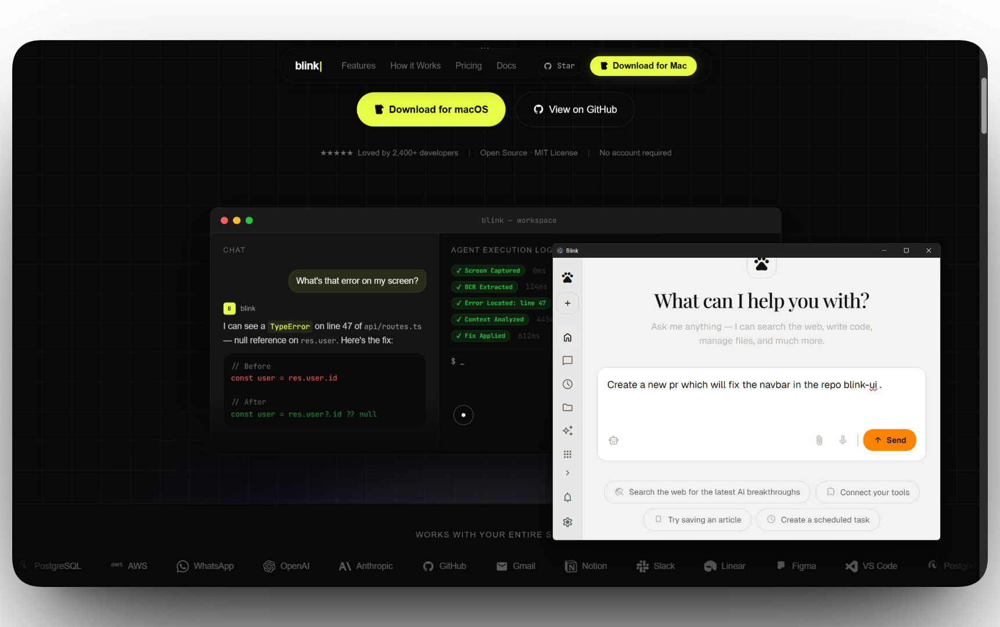
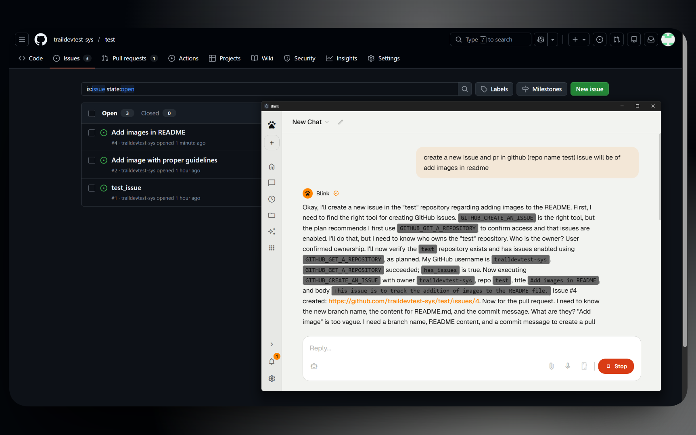
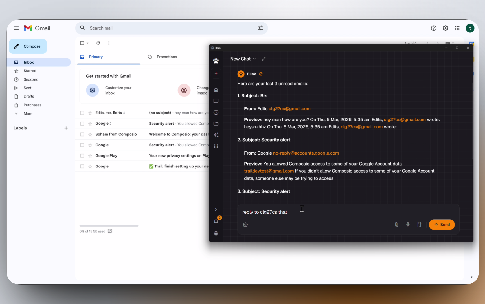

<p align="center">
  
</p>

# Blink AI

<p align="center">
  <a href="https://github.com/MohitGoyal09/coworker">
    
  </a>
  <a href="https://ui-blink.vercel.app/">
    
  </a>
  <a href="https://github.com/MohitGoyal09/coworker/releases">
    
  </a>
</p>

---

## ✨ Overview

**Blink AI** is an intelligent desktop AI assistant built with [Electron](https://www.electronjs.org/), [React](https://react.dev/), [TypeScript](https://www.typescriptlang.org/), and [Mastra](https://mastra.ai). It serves as a powerful, extensible workspace that seamlessly manages tasks, answers complex queries, and automates workflows through an intuitive chat interface.

With natively integrated capabilities like voice recognition, screen capture analysis, and expansive tool routing, Blink acts as a highly capable AI teammate tailored to dramatically accelerate your productivity.

### 🎯 Why Blink?

- **🔒 Privacy-First**: Your data stays exactly where it belongs—with you. All processing happens locally on your machine.
- **🧠 240+ Tools**: Connect to Gmail, GitHub, Google Calendar, WhatsApp, and 240+ other tools via Composio and MCP servers.
- **⚡ Open Source**: Fully transparent, extensible, and built for the community.
- **🎨 No Account Required**: Download, configure your API keys, and start using immediately.

---

## 😤 The Problem (We've All Been There)

### Meet Sarah, the Developer

It's 3 PM. Sarah is deep in debugging mode when she gets a Slack ping about a critical GitHub issue. She:

1. **Alt+tabs** to her browser
2. **Opens** 5 different tabs (GitHub issue, Stack Overflow, ChatGPT, team docs, Jira)
3. **Copy-pastes** the error message into ChatGPT
4. **Waits** for a response while her flow state evaporates
5. **Switches back** to her IDE, having lost 15 minutes and her train of thought

Now she has to check her Gmail, respond to 3 meeting requests, and oh—someone just asked on WhatsApp if she saw that email. **Context-switching chaos.**

### Meet Marcus, the Product Manager

Marcus starts his day with 47 unread emails. He needs to:

- Draft responses to customer feedback
- Summarize yesterday's meeting notes for the team
- Create GitHub issues from the design team's requests
- Schedule follow-ups in Google Calendar
- Send a WhatsApp update to the remote team

By the time he's done, **it's 2 PM and he hasn't started his actual work.**

---

## ✨ How Blink Solves It

**Blink lives where you work—on your desktop, always ready.**

### For Sarah 🧑‍💻

> **"Hey Blink, what's this error about?"**

- **Screen capture** reads her error message instantly
- **AI analyzes** the stack trace with full context
- **Suggests a fix** in 3 seconds—no tab switching
- **Creates a GitHub issue** with one command: _"Blink, file this as an issue"_
- **Drafts her email** response while she keeps coding

**Result**: Sarah stays in flow. Her 15-minute context switch becomes a 30-second question.

### For Marcus 📊

> **"Blink, summarize my emails from the design team"**

- **Scans Gmail** and pulls relevant threads
- **Generates a summary** with action items
- **Drafts replies** in his tone (learned from past emails)
- **Creates calendar events** for follow-ups
- **Sends WhatsApp updates** to the team—all from one chat interface

**Result**: Marcus reclaims his mornings. What took 4 hours now takes 45 minutes.

---

## 🚀 Key Features

| Feature | Description |
|---------|-------------|
| **AI Chat** | Intelligent conversational assistant for drafting content, summarizing docs, brainstorming, and solving development challenges |
| **Cloud-Powered** | Enterprise-grade backend harnessing **AWS** (S3, DynamoDB, SQS) for robust file storage, complex knowledge graphs, and task queues |
| **Voice Input** | Hands-free interactivity with real-time Deepgram transcription and Voice Activity Detection (VAD) |
| **Screen Capture** | Capture full screens or active windows with integrated OCR for contextual AI analysis |
| **File Handling** | Drag-and-drop support for documents, images, and codebase context directly in chat |
| **Integrations** | Deep connections to Gmail, Google Calendar, GitHub, and 80+ other platforms via Composio and MCP |
| **Skills & Superpowers** | Extend capabilities with Mastra skills and MCP servers from the community |
| **Autopilot Mode** | Let AI autonomously handle tasks like monitoring issues, sending emails, and managing workflows |
| **App Builder** | Visual UI editor for building internal tools and dashboards with AI-generated code |

---

## 🏗️ Architecture



### ☁️ Enterprise-Grade AWS Integration

Blink AI is built to scale gracefully. By integrating natively with **Amazon Web Services (AWS)**, Blink offloads heavy operations to the cloud for maximum reliability and speed:

- **📦 Amazon S3**: Secure, scalable object storage for managing user uploads, file context, and shared documents.
- **⚡ Amazon DynamoDB**: Blazing-fast NoSQL database operating as the backbone for Blink's overarching **Knowledge Graph**, enabling deep associative recall of concepts and workflows.
- **📨 Amazon SQS**: Robust message queuing infrastructure that handles asynchronous tasks, background scraping, and delayed scheduling workloads securely without blocking the UI.

### Architecture Flow



### Component Details

| Component | Location | Description |
|-----------|----------|-------------|
| **Query Classifier** | `src/mastra/agents/coworker/` | Regex-based complexity analysis - avoids loading heavy tools for simple queries |
| **Harness Pool** | `src/mastra/harness/pool.ts` | Thread lifecycle management with 30-min idle TTL |
| **Blink Agent** | `src/mastra/agents/coworker/agent.ts` | Main agent with BUILD/PLAN/FAST modes |
| **AWS Cloud Services** | `src/aws/` | Enterprise data backbone utilizing **S3** for files, **DynamoDB** for knowledge graphs, and **SQS** for workflows |
| **Composio / MCP** | `src/mastra/composio/` | Expansive tool hub enabling 250+ workflow integrations locally |
| **Memory System** | `src/mastra/memory.ts` | Embedded LibSQL vector database storing conversation context securely |
| **WhatsApp Bridge** | `src/mastra/whatsapp/` | Baileys-powered messaging with group support |


### Technology Stack

| Layer | Technology |
|-------|------------|
| **Runtime & Framework** | Bun, Mastra v1.6.0+ |
| **Desktop & Frontend** | Electron, React, TypeScript, Tailwind CSS |
| **Cloud Infrastructure**| **AWS** (S3, DynamoDB, SQS) |
| **Local Database** | LibSQL (SQLite) with FastEmbed |
| **AI Models** | OpenAI, Anthropic, Google Gemini, Ollama, LM Studio |
| **Integrations** | Deepgram (Voice), Composio (250+ tools), MCP |

---

## 🛠 Tech Stack

<p align="center">
  
</p>

- **Frontend**: React, TypeScript, Tailwind CSS
- **Desktop**: Electron
- **Cloud Infrastructure**: **AWS** (Amazon S3, DynamoDB, SQS)
- **AI Framework**: Mastra
- **Runtime**: Bun
- **Integrations**: Deepgram (Voice), Composio (Tool Routing), MCP (Model Context Protocol)
- **Local Database**: LibSQL (SQLite)

---

## 📸 Features Showcase

### 1. Intelligent Navigation & Chat Interface

<p align="center">
  
  <br />
  <em>Seamlessly switch between chat, files, skills, and settings with a modern, intuitive navigation system</em>
</p>

---

### 2. GitHub Automation - Issues & Pull Requests

<p align="center">
  
  <br />
  <em>Automate your GitHub workflow: AI monitors repositories, summarizes issues, reviews PRs, and manages automation tasks</em>
</p>

---

### 3. Gmail Automation - Fetch & Reply

<p align="center">
  
  <br />
  <em>Intelligent email automation: AI fetches relevant emails, summarizes conversations, and drafts intelligent replies</em>
</p>

---

## 📺 Demo Video

<p align="center">
  <a href="https://youtu.be/IDO_4qFAtoY?si=01o0cCbrv9Y8ZWWa">
    
  </a>
  <br />
  <em>Watch the full demo on YouTube ↗️</em>
</p>

---

## 🏃 Quick Start

### Prerequisites

- [Bun](https://bun.sh/) runtime
- Node.js 18+
- API keys for AI providers (OpenAI, Anthropic, Google Gemini, etc.)

### Local Development

```bash
# 1. Clone the repository
git clone https://github.com/MohitGoyal09/coworker.git
cd Blink

# 2. Install dependencies
bun install

# 3. Configure environment
cp .env.example .env
# Edit .env with your API keys

# 4. Start the development server
bun run dev

# 5. Launch the Electron desktop app (in another terminal)
cd app
bun install
bun run dev
```

The desktop app will connect to `http://localhost:4111` by default. To connect to a remote server, go to **Settings → Advanced** and update the Server URL.

### Docker Deployment

```bash
docker compose up
```

---

## 🔗 Links

- **GitHub**: [https://github.com/MohitGoyal09/coworker](https://github.com/MohitGoyal09/coworker)
- **UI Demo**: [https://ui-blink.vercel.app/](https://ui-blink.vercel.app/)
- **Documentation**: [Mastra Docs](https://mastra.ai)
- **Issues**: [https://github.com/MohitGoyal09/coworker/issues](https://github.com/MohitGoyal09/coworker/issues)

---

## 🤝 Contributing

Contributions are welcome! Please read our [Contributing Guide](CONTRIBUTING.md) for details on how to get started.

---

## 📄 License

This project is licensed under the MIT License - see the [LICENSE](LICENSE) file for details.

---

<p align="center">
  <em>Built with ❤️ using Mastra, Electron, and React</em>
</p>
