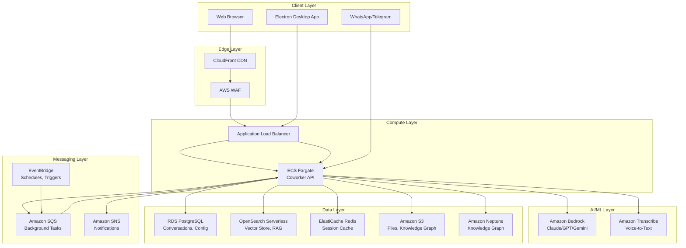
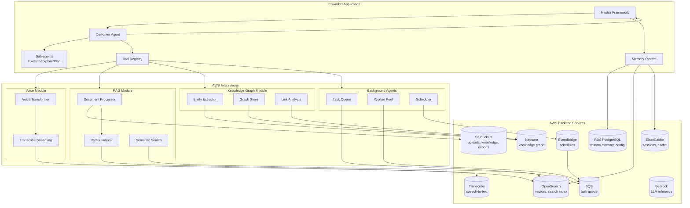
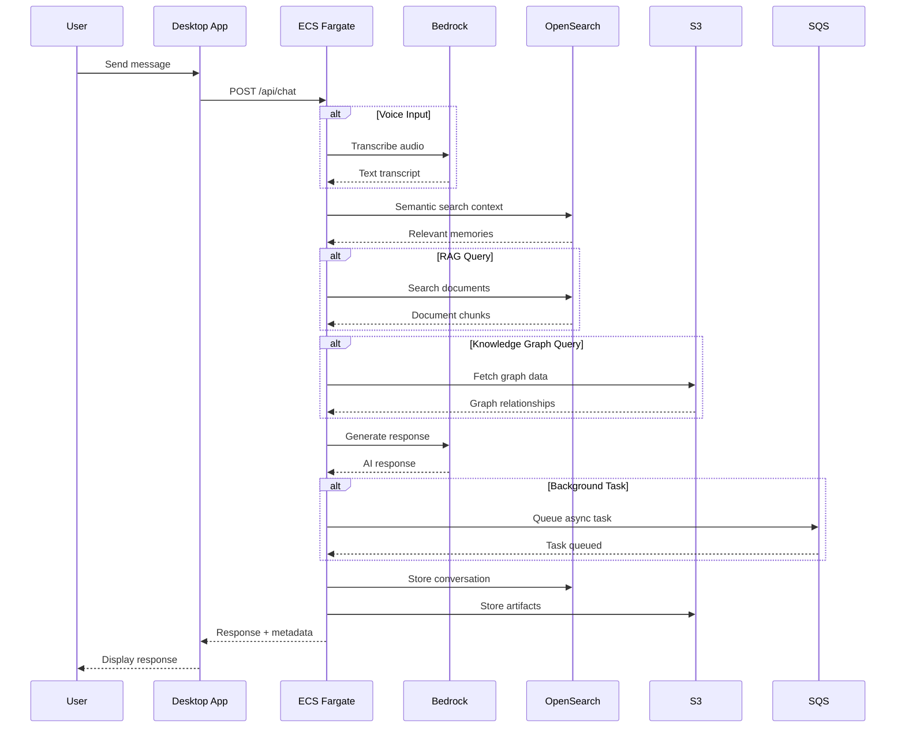

# AWS Architecture Guide: Coworker AI Hackathon Deployment

**Version:** 1.0  
**Date:** March 4, 2026  
**Target:** Hackathon-optimized, cost-effective AWS deployment  
**Estimated Monthly Cost:** $50-150 (development/demo tier)

---

## Table of Contents

1. [Architecture Overview](#1-architecture-overview)
2. [AWS Services Reference](#2-aws-services-reference)
3. [Architecture Diagrams](#3-architecture-diagrams)
4. [Hackathon-Optimized Setup](#4-hackathon-optimized-setup)
5. [Integration Points for Missing Features](#5-integration-points-for-missing-features)
6. [Step-by-Step Deployment Guide](#6-step-by-step-deployment-guide)
7. [Environment Configuration](#7-environment-configuration)
8. [Cost Estimation](#8-cost-estimation)
9. [Security Best Practices](#9-security-best-practices)
10. [Troubleshooting](#10-troubleshooting)

---

## 1. Architecture Overview

Coworker AI is a Mastra-based AI agent system requiring compute, storage, messaging, and AI/ML services. This architecture provides a scalable, cost-effective foundation for hackathon demos and MVP deployments.

### Current Coworker Stack (Baseline)

| Component | Current Tech | AWS Replacement |
|-----------|--------------|-----------------|
| Runtime | Bun/Node.js | AWS ECS Fargate |
| Database | LibSQL (local) | Amazon RDS PostgreSQL + S3 |
| Vector Store | LibSQLVector | Amazon OpenSearch Serverless |
| Memory | Mastra Memory | OpenSearch + ElastiCache Redis |
| File Storage | Local filesystem | Amazon S3 |
| Scheduling | Inngest | Amazon EventBridge + SQS |
| AI Models | Multi-provider | Amazon Bedrock |

### Missing Features to Integrate

| Feature | AWS Service | Purpose |
|---------|-------------|---------|
| Voice Input | Amazon Transcribe | Speech-to-text for voice commands |
| RAG | OpenSearch + Kendra | Document search and retrieval |
| Knowledge Graph | Neptune | Structured relationship storage |
| Background Agents | SQS + EventBridge | Async task processing |

---

## 2. AWS Services Reference

### 2.1 Core Infrastructure

| Service | Purpose | Hackathon Tier | Production Tier |
|---------|---------|----------------|-----------------|
| **Amazon ECS Fargate** | Container orchestration | 1 vCPU / 2 GB | 2 vCPU / 4 GB |
| **Amazon RDS PostgreSQL** | Structured data storage | db.t3.micro | db.t3.small |
| **Amazon OpenSearch** | Vector search, RAG | Serverless (2 OCUs) | Serverless (4 OCUs) |
| **Amazon ElastiCache Redis** | Session cache, rate limiting | cache.t3.micro | cache.t3.small |
| **Amazon S3** | File storage, knowledge graph | Standard | Standard-IA |
| **Amazon SQS** | Background task queue | Standard queue | FIFO queue |
| **Amazon EventBridge** | Scheduled tasks, triggers | Free tier | Standard |
| **Amazon Bedrock** | AI/LLM inference | On-demand | Provisioned |
| **Amazon Transcribe** | Voice-to-text | Streaming | Batch + Streaming |
| **Amazon Neptune** | Knowledge graph | db.t3.medium | db.r5.large |
| **AWS Secrets Manager** | API key storage | Free tier | Standard |
| **Amazon CloudWatch** | Logging, monitoring | Free tier | Paid tier |
| **AWS Application Load Balancer** | Traffic distribution | Free tier | LCU-based |

### 2.2 Service Selection Rationale

**Why ECS Fargate over Lambda?**
- Coworker uses Bun runtime with persistent connections
- WebSocket support for real-time chat
- Long-running background agents
- Simpler local development parity

**Why OpenSearch over Pinecone/Qdrant?**
- Native AWS integration
- No egress costs between services
- Supports both vector and keyword search
- Serverless option eliminates capacity planning

**Why RDS PostgreSQL over DynamoDB?**
- Mastra uses LibSQL (SQLite-compatible)
- PostgreSQL has better SQL compatibility
- Easier migration path from local LibSQL

---

## 3. Architecture Diagrams

### 3.1 High-Level Architecture



### 3.2 Detailed Component Architecture



### 3.3 Data Flow Diagram



---

## 4. Hackathon-Optimized Setup

### 4.1 Resource Sizing

| Service | Specs | Monthly Cost | Notes |
|---------|-------|--------------|-------|
| **ECS Fargate** | 1 vCPU, 2 GB RAM, Spot | ~$15 | Use Spot for 70% savings |
| **RDS PostgreSQL** | db.t3.micro | ~$13 | Single AZ, disable for hackathon |
| **OpenSearch Serverless** | 1 OCU indexing, 1 OCU search | ~$25 | Auto-scales to zero |
| **ElastiCache Redis** | cache.t3.micro | ~$12 | Optional for hackathon |
| **S3** | 10 GB Standard | ~$0.23 | Negligible at demo scale |
| **SQS** | 1M requests | ~$0.40 | Free tier covers 1M |
| **EventBridge** | 100 schedules | Free | Free tier covers 100 |
| **Bedrock** | Claude 3.5 Sonnet | ~$5-20 | Pay per token |
| **Transcribe** | 10 hours audio | Free tier | 60 min/month free |
| **ALB** | 10 LCU-hours/day | ~$16 | Free tier for 750 hrs |
| **CloudWatch** | 10 GB logs | ~$5 | Free tier covers 5 GB |
| **Secrets Manager** | 10 secrets | ~$4 | $0.40/secret/month |
| **Total** | | **~$90-115/month** | **~$50 with optimizations** |

### 4.2 Cost Optimization Strategies

1. **Use Fargate Spot**: 70% cost reduction with acceptable interruption risk
2. **Pause RDS overnight**: Use Lambda to stop/start during hackathon hours
3. **OpenSearch Serverless**: Scales to zero when not in use
4. **Shared ALB**: Use single ALB for multiple services
5. **Bedrock Lite models**: Use Claude 3 Haiku for non-critical tasks
6. **S3 Intelligent-Tiering**: Automatic cost optimization for files

### 4.3 Free Tier Eligibility

| Service | Free Tier | Hackathon Usage |
|---------|-----------|-----------------|
| SQS | 1M requests/month | Well within limits |
| EventBridge | 100 schedules | Sufficient |
| Secrets Manager | 30 days free | Rotate before billing |
| CloudWatch | 5 GB logs | Monitor usage |
| Transcribe | 60 minutes/month | Limited demos |

---

## 5. Integration Points for Missing Features

### 5.1 Voice Input (Amazon Transcribe)

```typescript
// src/mastra/tools/voice-transcription.ts
import { TranscribeStreamingClient, StartStreamTranscriptionCommand } from "@aws-sdk/client-transcribe-streaming";
import { createTool } from "@mastra/core";

export const voiceTranscriptionTool = createTool({
  id: "voice-transcribe",
  description: "Transcribe audio to text using AWS Transcribe",
  inputSchema: z.object({
    audioStream: z.instanceof(Buffer).describe("Audio buffer (PCM, 16kHz)"),
    languageCode: z.string().default("en-US"),
  }),
  outputSchema: z.object({
    transcript: z.string(),
    confidence: z.number(),
  }),
  execute: async ({ context }) => {
    const client = new TranscribeStreamingClient({ region: process.env.AWS_REGION });
    
    const command = new StartStreamTranscriptionCommand({
      LanguageCode: context.languageCode,
      MediaEncoding: "pcm",
      MediaSampleRateHertz: 16000,
      AudioStream: context.audioStream,
    });
    
    const response = await client.send(command);
    // Process streaming response
    return { transcript: "...", confidence: 0.95 };
  },
});
```

**Architecture Flow:**
```
User Microphone → Browser Web Audio API → PCM Stream → 
ECS Container → Transcribe Streaming API → Text → 
Coworker Agent Processing
```

### 5.2 RAG with OpenSearch

```typescript
// src/mastra/tools/rag-search.ts
import { OpenSearchClient, SearchCommand } from "@aws-sdk/client-opensearch";
import { createTool } from "@mastra/core";

export const ragSearchTool = createTool({
  id: "rag-search",
  description: "Search documents using semantic RAG",
  inputSchema: z.object({
    query: z.string(),
    index: z.string().default("coworker-docs"),
    topK: z.number().default(5),
  }),
  execute: async ({ context }) => {
    // Generate embedding via Bedrock
    const embedding = await generateEmbedding(context.query);
    
    const client = new OpenSearchClient({ 
      endpoint: process.env.OPENSEARCH_ENDPOINT 
    });
    
    const searchResponse = await client.send(new SearchCommand({
      index: context.index,
      body: {
        size: context.topK,
        query: {
          knn: {
            vector_field: {
              vector: embedding,
              k: context.topK,
            },
          },
        },
      },
    }));
    
    return {
      results: searchResponse.hits.hits.map(hit => ({
        content: hit._source.content,
        score: hit._score,
        source: hit._source.metadata?.source,
      })),
    };
  },
});

// Document ingestion pipeline
export const ingestDocument = async (fileBuffer: Buffer, filename: string) => {
  // 1. Upload to S3
  await s3Client.send(new PutObjectCommand({
    Bucket: process.env.S3_BUCKET,
    Key: `uploads/${filename}`,
    Body: fileBuffer,
  }));
  
  // 2. Extract text (use Textract for PDFs/DOCXs)
  const extractedText = await extractText(fileBuffer, filename);
  
  // 3. Chunk and embed
  const chunks = chunkDocument(extractedText);
  const embeddings = await Promise.all(chunks.map(generateEmbedding));
  
  // 4. Index in OpenSearch
  await Promise.all(chunks.map((chunk, i) => 
    indexDocument({
      content: chunk,
      vector: embeddings[i],
      metadata: { source: filename, chunk: i },
    })
  ));
};
```

**Architecture Flow:**
```
File Upload → S3 → S3 Event → Lambda → 
Textract (if PDF/DOCX) → Text Chunks → 
Bedrock Embeddings → OpenSearch Indexing
```

### 5.3 Knowledge Graph (Amazon Neptune)

```typescript
// src/mastra/tools/knowledge-graph.ts
import { NeptuneClient, ExecuteGremlinQueryCommand } from "@aws-sdk/client-neptune";

export const knowledgeGraphTool = createTool({
  id: "knowledge-graph-query",
  description: "Query the knowledge graph for relationships",
  inputSchema: z.object({
    entity: z.string(),
    relationship: z.string().optional(),
    depth: z.number().default(2),
  }),
  execute: async ({ context }) => {
    const gremlinQuery = `
      g.V().has('name', '${context.entity}')
        .repeat(outE().inV().simplePath())
        .times(${context.depth})
        .path()
        .by(valueMap(true))
    `;
    
    const client = new NeptuneClient({ region: process.env.AWS_REGION });
    const result = await client.send(new ExecuteGremlinQueryCommand({
      query: gremlinQuery,
    }));
    
    return { relationships: parseNeptuneResult(result) };
  },
});

// Knowledge extraction from conversations
export const extractKnowledge = async (conversation: string) => {
  // Use Bedrock to extract entities and relationships
  const extractionPrompt = `
    Extract entities and relationships from this conversation.
    Return as JSON: { entities: [{name, type}], relationships: [{from, to, type}] }
    
    Conversation: ${conversation}
  `;
  
  const extraction = await bedrockInvoke(extractionPrompt);
  
  // Store in Neptune
  for (const entity of extraction.entities) {
    await addEntity(entity);
  }
  for (const rel of extraction.relationships) {
    await addRelationship(rel);
  }
};
```

**Architecture Flow:**
```
Conversation → Bedrock Extraction → Entities/Relations → 
Neptune Graph Store → Query for Context
```

### 5.4 Background Agents (SQS + EventBridge)

```typescript
// src/mastra/tools/background-tasks.ts
import { SQSClient, SendMessageCommand } from "@aws-sdk/client-sqs";
import { EventBridgeClient, PutRuleCommand, PutTargetsCommand } from "@aws-sdk/client-eventbridge";

export const scheduleBackgroundTask = async (task: BackgroundTask) => {
  const sqsClient = new SQSClient({ region: process.env.AWS_REGION });
  
  await sqsClient.send(new SendMessageCommand({
    QueueUrl: process.env.SQS_QUEUE_URL,
    MessageBody: JSON.stringify(task),
    MessageAttributes: {
      TaskType: { StringValue: task.type, DataType: "String" },
      Priority: { StringValue: task.priority, DataType: "String" },
    },
  }));
};

// Worker processing
export const processBackgroundTasks = async () => {
  const sqsClient = new SQSClient({ region: process.env.AWS_REGION });
  
  while (true) {
    const { Messages } = await sqsClient.send(new ReceiveMessageCommand({
      QueueUrl: process.env.SQS_QUEUE_URL,
      MaxNumberOfMessages: 10,
      WaitTimeSeconds: 20,
    }));
    
    if (Messages) {
      for (const message of Messages) {
        const task = JSON.parse(message.Body!);
        await executeBackgroundTask(task);
        
        await sqsClient.send(new DeleteMessageCommand({
          QueueUrl: process.env.SQS_QUEUE_URL,
          ReceiptHandle: message.ReceiptHandle!,
        }));
      }
    }
  }
};

// Scheduled tasks via EventBridge
export const createScheduledTask = async (cron: string, task: BackgroundTask) => {
  const eventBridge = new EventBridgeClient({ region: process.env.AWS_REGION });
  const ruleName = `coworker-task-${Date.now()}`;
  
  await eventBridge.send(new PutRuleCommand({
    Name: ruleName,
    ScheduleExpression: `cron(${cron})`,
    State: "ENABLED",
  }));
  
  await eventBridge.send(new PutTargetsCommand({
    Rule: ruleName,
    Targets: [{
      Id: "1",
      Arn: process.env.SQS_QUEUE_ARN,
      Input: JSON.stringify(task),
    }],
  }));
};
```

**Architecture Flow:**
```
Scheduled Rule (EventBridge) → SQS Queue → ECS Worker → 
Task Execution → Result Storage (RDS/S3)
```

---

## 6. Step-by-Step Deployment Guide

### 6.1 Prerequisites

- AWS CLI configured (`aws configure`)
- Docker installed
- Node.js/Bun installed locally
- Domain name (optional, use CloudFront default for hackathon)

### 6.2 Step 1: VPC and Networking

```bash
# Create VPC
aws ec2 create-vpc --cidr-block 10.0.0.0/16 --tag-specifications 'ResourceType=vpc,Tags=[{Key=Name,Value=coworker-vpc}]'

# Create subnets (2 public, 2 private for high availability)
aws ec2 create-subnet --vpc-id <vpc-id> --cidr-block 10.0.1.0/24 --availability-zone us-east-1a
aws ec2 create-subnet --vpc-id <vpc-id> --cidr-block 10.0.2.0/24 --availability-zone us-east-1b
aws ec2 create-subnet --vpc-id <vpc-id> --cidr-block 10.0.3.0/24 --availability-zone us-east-1a
aws ec2 create-subnet --vpc-id <vpc-id> --cidr-block 10.0.4.0/24 --availability-zone us-east-1b

# Create Internet Gateway
aws ec2 create-internet-gateway --tag-specifications 'ResourceType=internet-gateway,Tags=[{Key=Name,Value=coworker-igw}]'
aws ec2 attach-internet-gateway --internet-gateway-id <igw-id> --vpc-id <vpc-id>

# Create NAT Gateway (for private subnets to access internet)
aws ec2 allocate-address --domain vpc
aws ec2 create-nat-gateway --subnet-id <public-subnet-1> --allocation-id <eip-allocation-id>

# Update route tables...
```

### 6.3 Step 2: Security Groups

```bash
# ALB Security Group
aws ec2 create-security-group \
  --group-name coworker-alb-sg \
  --description "ALB for Coworker" \
  --vpc-id <vpc-id>

aws ec2 authorize-security-group-ingress \
  --group-id <alb-sg-id> \
  --protocol tcp \
  --port 443 \
  --cidr 0.0.0.0/0

aws ec2 authorize-security-group-ingress \
  --group-id <alb-sg-id> \
  --protocol tcp \
  --port 80 \
  --cidr 0.0.0.0/0

# ECS Security Group
aws ec2 create-security-group \
  --group-name coworker-ecs-sg \
  --description "ECS tasks for Coworker" \
  --vpc-id <vpc-id>

aws ec2 authorize-security-group-ingress \
  --group-id <ecs-sg-id> \
  --protocol tcp \
  --port 4111 \
  --source-group <alb-sg-id>

# RDS Security Group
aws ec2 create-security-group \
  --group-name coworker-rds-sg \
  --description "RDS for Coworker" \
  --vpc-id <vpc-id>

aws ec2 authorize-security-group-ingress \
  --group-id <rds-sg-id> \
  --protocol tcp \
  --port 5432 \
  --source-group <ecs-sg-id>
```

### 6.4 Step 3: RDS PostgreSQL

```bash
# Create DB subnet group
aws rds create-db-subnet-group \
  --db-subnet-group-name coworker-db-subnet \
  --db-subnet-group-description "Subnet group for Coworker RDS" \
  --subnet-ids '["<private-subnet-1>","<private-subnet-2>"]'

# Create RDS instance
aws rds create-db-instance \
  --db-instance-identifier coworker-db \
  --db-instance-class db.t3.micro \
  --engine postgres \
  --engine-version 15.4 \
  --allocated-storage 20 \
  --storage-type gp2 \
  --master-username coworker_admin \
  --master-user-password <generate-secure-password> \
  --vpc-security-group-ids <rds-sg-id> \
  --db-subnet-group-name coworker-db-subnet \
  --publicly-accessible false \
  --backup-retention-period 7 \
  --no-multi-az

# Store password in Secrets Manager
aws secretsmanager create-secret \
  --name coworker/db-password \
  --secret-string <secure-password>
```

### 6.5 Step 4: ElastiCache Redis

```bash
# Create subnet group
aws elasticache create-cache-subnet-group \
  --cache-subnet-group-name coworker-redis-subnet \
  --cache-subnet-group-description "Subnet group for Coworker Redis" \
  --subnet-ids '["<private-subnet-1>","<private-subnet-2>"]'

# Create Redis cluster
aws elasticache create-cache-cluster \
  --cache-cluster-id coworker-redis \
  --engine redis \
  --cache-node-type cache.t3.micro \
  --num-cache-nodes 1 \
  --cache-subnet-group-name coworker-redis-subnet \
  --security-group-ids <redis-sg-id>
```

### 6.6 Step 5: OpenSearch Serverless

```bash
# Create encryption policy
aws opensearchserverless create-security-policy \
  --name coworker-encryption \
  --type encryption \
  --policy '{"Rules":[{"ResourceType":"collection","Resource":["collection/coworker-*"]}],"AWSOwnedKey":true}'

# Create network policy
aws opensearchserverless create-security-policy \
  --name coworker-network \
  --type network \
  --policy '[{"Description":"Public access","Rules":[{"ResourceType":"collection","Resource":["collection/coworker-vectors"]}],"AllowFromPublic":true}]'

# Create access policy
aws opensearchserverless create-access-policy \
  --name coworker-access \
  --type data \
  --policy '[{"Rules":[{"ResourceType":"index","Resource":["index/coworker-vectors/*"],"Permission":["aoss:*"]},{"ResourceType":"collection","Resource":["collection/coworker-vectors"],"Permission":["aoss:*"]}],"Principal":["arn:aws:iam::<account-id>:role/coworker-ecs-role"]}]'

# Create collection
aws opensearchserverless create-collection \
  --name coworker-vectors \
  --type VECTORSEARCH \
  --standby-replicas DISABLED
```

### 6.7 Step 6: S3 Buckets

```bash
# Create buckets
aws s3 mb s3://coworker-uploads-<unique-id> --region us-east-1
aws s3 mb s3://coworker-knowledge-<unique-id> --region us-east-1
aws s3 mb s3://coworker-exports-<unique-id> --region us-east-1

# Enable versioning
aws s3api put-bucket-versioning \
  --bucket coworker-uploads-<unique-id> \
  --versioning-configuration Status=Enabled

# Block public access
aws s3api put-public-access-block \
  --bucket coworker-uploads-<unique-id> \
  --public-access-block-configuration BlockPublicAcls=true,IgnorePublicAcls=true,BlockPublicPolicy=true,RestrictPublicBuckets=true

# CORS configuration for uploads
cat > cors.json << 'EOF'
{
  "CORSRules": [
    {
      "AllowedHeaders": ["*"],
      "AllowedMethods": ["PUT", "POST", "GET"],
      "AllowedOrigins": ["https://your-domain.com"],
      "MaxAgeSeconds": 3000
    }
  ]
}
EOF

aws s3api put-bucket-cors \
  --bucket coworker-uploads-<unique-id> \
  --cors-configuration file://cors.json
```

### 6.8 Step 7: SQS Queue

```bash
# Create main task queue
aws sqs create-queue \
  --queue-name coworker-tasks \
  --attributes '{"VisibilityTimeout":"300","MessageRetentionPeriod":"1209600"}'

# Create DLQ
aws sqs create-queue \
  --queue-name coworker-tasks-dlq \
  --attributes '{"MessageRetentionPeriod":"1209600"}'

# Get queue URLs for environment variables
aws sqs get-queue-url --queue-name coworker-tasks
aws sqs get-queue-attributes \
  --queue-url <queue-url> \
  --attribute-names QueueArn
```

### 6.9 Step 8: ECS Cluster and Task Definition

```bash
# Create ECS cluster
aws ecs create-cluster \
  --cluster-name coworker-cluster \
  --settings name=containerInsights,value=enabled \
  --capacity-providers FARGATE FARGATE_SPOT \
  --default-capacity-provider-strategy capacityProvider=FARGATE_SPOT,weight=1,base=1

# Create IAM role for ECS tasks
aws iam create-role \
  --role-name coworker-ecs-role \
  --assume-role-policy-document '{
    "Version": "2012-10-17",
    "Statement": [{
      "Effect": "Allow",
      "Principal": {"Service": "ecs-tasks.amazonaws.com"},
      "Action": "sts:AssumeRole"
    }]
  }'

# Attach policies
aws iam attach-role-policy \
  --role-name coworker-ecs-role \
  --policy-arn arn:aws:iam::aws:policy/service-role/AmazonECSTaskExecutionRolePolicy

aws iam attach-role-policy \
  --role-name coworker-ecs-role \
  --policy-arn arn:aws:iam::aws:policy/AmazonS3FullAccess

aws iam attach-role-policy \
  --role-name coworker-ecs-role \
  --policy-arn arn:aws:iam::aws:policy/AmazonSQSFullAccess

aws iam attach-role-policy \
  --role-name coworker-ecs-role \
  --policy-arn arn:aws:iam::aws:policy/AmazonBedrockFullAccess
```

Task Definition JSON (`task-definition.json`):

```json
{
  "family": "coworker",
  "networkMode": "awsvpc",
  "requiresCompatibilities": ["FARGATE"],
  "cpu": "1024",
  "memory": "2048",
  "executionRoleArn": "arn:aws:iam::<account-id>:role/ecsTaskExecutionRole",
  "taskRoleArn": "arn:aws:iam::<account-id>:role/coworker-ecs-role",
  "containerDefinitions": [
    {
      "name": "coworker",
      "image": "<account-id>.dkr.ecr.us-east-1.amazonaws.com/coworker:latest",
      "portMappings": [
        {
          "containerPort": 4111,
          "protocol": "tcp"
        }
      ],
      "environment": [
        { "name": "NODE_ENV", "value": "production" },
        { "name": "PORT", "value": "4111" },
        { "name": "AWS_REGION", "value": "us-east-1" }
      ],
      "secrets": [
        {
          "name": "DATABASE_URL",
          "valueFrom": "arn:aws:secretsmanager:<region>:<account-id>:secret:coworker/db-url"
        },
        {
          "name": "REDIS_URL",
          "valueFrom": "arn:aws:secretsmanager:<region>:<account-id>:secret:coworker/redis-url"
        },
        {
          "name": "BEDROCK_API_KEY",
          "valueFrom": "arn:aws:secretsmanager:<region>:<account-id>:secret:coworker/bedrock-key"
        }
      ],
      "logConfiguration": {
        "logDriver": "awslogs",
        "options": {
          "awslogs-group": "/ecs/coworker",
          "awslogs-region": "us-east-1",
          "awslogs-stream-prefix": "ecs"
        }
      }
    }
  ]
}
```

```bash
# Register task definition
aws ecs register-task-definition --cli-input-json file://task-definition.json

# Create service
aws ecs create-service \
  --cluster coworker-cluster \
  --service-name coworker-service \
  --task-definition coworker:1 \
  --desired-count 1 \
  --launch-type FARGATE \
  --network-configuration "awsvpcConfiguration={subnets=[<private-subnet-1>,<private-subnet-2>],securityGroups=[<ecs-sg-id>],assignPublicIp=DISABLED}" \
  --load-balancers "targetGroupArn=<target-group-arn>,containerName=coworker,containerPort=4111"
```

### 6.10 Step 9: Application Load Balancer

```bash
# Create ALB
aws elbv2 create-load-balancer \
  --name coworker-alb \
  --subnets <public-subnet-1> <public-subnet-2> \
  --security-groups <alb-sg-id> \
  --scheme internet-facing \
  --type application

# Create target group
aws elbv2 create-target-group \
  --name coworker-tg \
  --protocol HTTP \
  --port 4111 \
  --vpc-id <vpc-id> \
  --target-type ip \
  --health-check-path /api/health

# Create listener
aws elbv2 create-listener \
  --load-balancer-arn <alb-arn> \
  --protocol HTTP \
  --port 80 \
  --default-actions Type=forward,TargetGroupArn=<target-group-arn>
```

### 6.11 Step 10: ECR Repository and Docker Build

```bash
# Create ECR repository
aws ecr create-repository --repository-name coworker --region us-east-1

# Login to ECR
aws ecr get-login-password --region us-east-1 | docker login --username AWS --password-stdin <account-id>.dkr.ecr.us-east-1.amazonaws.com

# Build and push
docker build -t coworker .
docker tag coworker:latest <account-id>.dkr.ecr.us-east-1.amazonaws.com/coworker:latest
docker push <account-id>.dkr.ecr.us-east-1.amazonaws.com/coworker:latest
```

### 6.12 Step 11: CloudFront (Optional but Recommended)

```bash
# Create CloudFront distribution
aws cloudfront create-distribution \
  --distribution-config '{
    "CallerReference": "coworker-'$(date +%s)'",
    "Origins": {
      "Quantity": 1,
      "Items": [{
        "Id": "ALB",
        "DomainName": "<alb-dns-name>",
        "CustomOriginConfig": {
          "HTTPPort": 80,
          "OriginProtocolPolicy": "http-only"
        }
      }]
    },
    "DefaultCacheBehavior": {
      "TargetOriginId": "ALB",
      "ViewerProtocolPolicy": "redirect-to-https",
      "CachePolicyId": "4135ea2d-6df8-44a3-9df3-4b5a84be39ad",
      "OriginRequestPolicyId": "216adef6-5c7f-47e4-b989-5492eafa07d3"
    },
    "Comment": "Coworker AI CDN",
    "Enabled": true
  }'
```

---

## 7. Environment Configuration

### 7.1 Required Environment Variables

Create a `.env.production` file for the ECS deployment:

```bash
# === Core Application ===
NODE_ENV=production
PORT=4111
DATA_PATH=/app/data

# === AWS Region ===
AWS_REGION=us-east-1
AWS_DEFAULT_REGION=us-east-1

# === Database ===
# PostgreSQL connection string (RDS)
DATABASE_URL=postgresql://coworker_admin:<password>@<rds-endpoint>:5432/coworker

# === Cache ===
# Redis connection string (ElastiCache)
REDIS_URL=redis://<redis-endpoint>:6379

# === Vector Store ===
# OpenSearch Serverless endpoint
OPENSEARCH_ENDPOINT=https://<collection-id>.us-east-1.aoss.amazonaws.com
OPENSEARCH_INDEX=coworker-vectors

# === File Storage ===
S3_BUCKET=coworker-uploads-<unique-id>
S3_REGION=us-east-1
S3_KNOWLEDGE_BUCKET=coworker-knowledge-<unique-id>
S3_EXPORTS_BUCKET=coworker-exports-<unique-id>

# === Messaging ===
SQS_QUEUE_URL=https://sqs.us-east-1.amazonaws.com/<account-id>/coworker-tasks
SQS_QUEUE_ARN=arn:aws:sqs:us-east-1:<account-id>:coworker-tasks

# === AI/ML Services ===
# Bedrock model configuration
BEDROCK_MODEL=anthropic.claude-3-5-sonnet-20241022-v2:0
BEDROCK_REGION=us-east-1
BEDROCK_EMBEDDING_MODEL=amazon.titan-embed-text-v2:0

# Alternative: Use other providers alongside Bedrock
OPENAI_API_KEY=sk-...
ANTHROPIC_API_KEY=sk-ant-...

# === Voice (Amazon Transcribe) ===
TRANSCRIBE_ENABLED=true
TRANSCRIBE_LANGUAGE_CODE=en-US

# === Knowledge Graph (Amazon Neptune) ===
NEPTUNE_ENDPOINT=<neptune-cluster-endpoint>
NEPTUNE_PORT=8182
NEPTUNE_ENABLED=true

# === Security ===
# Generate with: openssl rand -base64 32
COWORKER_API_TOKEN=<secure-jwt-token>
JWT_SECRET=<secure-jwt-secret>

# === OAuth (Google Workspace Integration) ===
GOG_GOOGLE_CLIENT_ID=<google-client-id>
GOG_GOOGLE_CLIENT_SECRET=<google-client-secret>
GOG_KEYRING_PASSWORD=<secure-password>

# === WhatsApp Bridge ===
WHATSAPP_ENABLED=true
WHATSAPP_SESSION_PATH=/app/data/whatsapp

# === MCP Configuration ===
MCP_REGISTRY_URL=https://registry.mcp.ai
MCP_ALLOWED_SERVERS=*

# === Observability ===
CLOUDWATCH_LOG_GROUP=/ecs/coworker
OTEL_EXPORTER_OTLP_ENDPOINT=https://xray-daemon:2000
```

### 7.2 Secrets Manager Configuration

Store sensitive values in AWS Secrets Manager:

```bash
# Database credentials
aws secretsmanager create-secret \
  --name coworker/db-credentials \
  --secret-string '{
    "username": "coworker_admin",
    "password": "<secure-password>",
    "host": "<rds-endpoint>",
    "port": "5432",
    "dbname": "coworker"
  }'

# Redis credentials
aws secretsmanager create-secret \
  --name coworker/redis-url \
  --secret-string 'redis://<redis-endpoint>:6379'

# API keys
aws secretsmanager create-secret \
  --name coworker/api-keys \
  --secret-string '{
    "OPENAI_API_KEY": "sk-...",
    "ANTHROPIC_API_KEY": "sk-ant-...",
    "GOOGLE_GENERATIVE_AI_API_KEY": "..."
  }'

# JWT secrets
aws secretsmanager create-secret \
  --name coworker/jwt-secrets \
  --secret-string '{
    "COWORKER_API_TOKEN": "<token>",
    "JWT_SECRET": "<secret>"
  }'
```

### 7.3 Parameter Store (Non-Secret Configuration)

```bash
# Store non-sensitive configuration in SSM Parameter Store
aws ssm put-parameter \
  --name /coworker/production/bedrock-model \
  --value "anthropic.claude-3-5-sonnet-20241022-v2:0" \
  --type String

aws ssm put-parameter \
  --name /coworker/production/opensearch-endpoint \
  --value "https://<collection-id>.us-east-1.aoss.amazonaws.com" \
  --type String

aws ssm put-parameter \
  --name /coworker/production/s3-bucket \
  --value "coworker-uploads-<unique-id>" \
  --type String
```

---

## 8. Cost Estimation

### 8.1 Development/Hackathon Tier (Monthly)

| Service | Configuration | Cost |
|---------|---------------|------|
| **ECS Fargate (Spot)** | 1 vCPU, 2 GB, ~20 hrs/day | $12 |
| **RDS PostgreSQL** | db.t3.micro, single AZ | $13 |
| **OpenSearch Serverless** | 1 OCU indexing, 1 OCU search | $25 |
| **ElastiCache Redis** | cache.t3.micro | $12 |
| **S3** | 10 GB Standard | $0.23 |
| **S3 API** | 10K requests | $0.05 |
| **SQS** | 1M requests | $0 |
| **EventBridge** | 100 schedules | $0 |
| **ALB** | 10 LCU-hours/day | $16 |
| **Bedrock** | Claude 3.5 Sonnet, ~100K tokens/day | $15 |
| **Transcribe** | 5 hours/month | $6 |
| **CloudWatch** | 5 GB logs | $0 |
| **Secrets Manager** | 5 secrets | $2 |
| **Data Transfer** | 50 GB out | $4.50 |
| **Total** | | **~$105/month** |

### 8.2 Cost Optimization for Hackathon

**Pause Resources Overnight (Saves ~60%):**

```bash
# Lambda function to stop RDS and ECS overnight
# Trigger: Cron expression 0 20 * * ? * (8 PM daily)

import boto3

def lambda_handler(event, context):
    # Stop ECS service
    ecs = boto3.client('ecs')
    ecs.update_service(
        cluster='coworker-cluster',
        service='coworker-service',
        desiredCount=0
    )
    
    # Stop RDS instance
    rds = boto3.client('rds')
    rds.stop_db_instance(
        DBInstanceIdentifier='coworker-db'
    )

# Start in morning (8 AM)
def start_resources(event, context):
    ecs = boto3.client('ecs')
    ecs.update_service(
        cluster='coworker-cluster',
        service='coworker-service',
        desiredCount=1
    )
    
    rds = boto3.client('rds')
    rds.start_db_instance(
        DBInstanceIdentifier='coworker-db'
    )
```

**Expected Savings:**
- Running 12 hours/day: **~$63/month** (40% savings)
- Using Fargate Spot: **~$50/month** (additional 20% savings)

---

## 9. Security Best Practices

### 9.1 IAM Policies

**Task Role Policy (Least Privilege):**

```json
{
  "Version": "2012-10-17",
  "Statement": [
    {
      "Effect": "Allow",
      "Action": [
        "s3:GetObject",
        "s3:PutObject",
        "s3:DeleteObject",
        "s3:ListBucket"
      ],
      "Resource": [
        "arn:aws:s3:::coworker-uploads-*",
        "arn:aws:s3:::coworker-uploads-*/*",
        "arn:aws:s3:::coworker-knowledge-*",
        "arn:aws:s3:::coworker-knowledge-*/*"
      ]
    },
    {
      "Effect": "Allow",
      "Action": [
        "sqs:SendMessage",
        "sqs:ReceiveMessage",
        "sqs:DeleteMessage",
        "sqs:GetQueueAttributes"
      ],
      "Resource": "arn:aws:sqs:*:*:coworker-*"
    },
    {
      "Effect": "Allow",
      "Action": [
        "bedrock:InvokeModel",
        "bedrock:InvokeModelWithResponseStream"
      ],
      "Resource": "*"
    },
    {
      "Effect": "Allow",
      "Action": [
        "transcribe:StartStreamTranscription",
        "transcribe:StartTranscriptionJob"
      ],
      "Resource": "*"
    },
    {
      "Effect": "Allow",
      "Action": [
        "secretsmanager:GetSecretValue"
      ],
      "Resource": "arn:aws:secretsmanager:*:*:secret:coworker/*"
    },
    {
      "Effect": "Allow",
      "Action": [
        "aoss:APIAccessAll"
      ],
      "Resource": "arn:aws:aoss:*:*:collection/coworker-*"
    }
  ]
}
```

### 9.2 Network Security

1. **VPC Endpoints** (for S3, SQS, Bedrock) - keeps traffic private:

```bash
# VPC Endpoint for S3
aws ec2 create-vpc-endpoint \
  --vpc-id <vpc-id> \
  --service-name com.amazonaws.us-east-1.s3 \
  --vpc-endpoint-type Gateway \
  --route-table-ids <route-table-id>

# VPC Endpoint for SQS
aws ec2 create-vpc-endpoint \
  --vpc-id <vpc-id> \
  --service-name com.amazonaws.us-east-1.sqs \
  --vpc-endpoint-type Interface \
  --subnet-ids <private-subnet-1> <private-subnet-2> \
  --security-group-ids <endpoint-sg-id>
```

2. **WAF Rules** (protect against common attacks):

```bash
# Create WAF WebACL
aws wafv2 create-web-acl \
  --name coworker-waf \
  --scope CLOUDFRONT \
  --default-action Allow={} \
  --rules '[
    {
      "Name": "RateLimit",
      "Priority": 1,
      "Statement": {
        "RateBasedStatement": {
          "Limit": 2000,
          "AggregateKeyType": "IP"
        }
      },
      "Action": {"Block": {}},
      "VisibilityConfig": {
        "SampledRequestsEnabled": true,
        "CloudWatchMetricsEnabled": true,
        "MetricName": "RateLimit"
      }
    },
    {
      "Name": "AWSManagedRulesCommonRuleSet",
      "Priority": 2,
      "Statement": {
        "ManagedRuleGroupStatement": {
          "VendorName": "AWS",
          "Name": "AWSManagedRulesCommonRuleSet"
        }
      },
      "OverrideAction": {"None": {}},
      "VisibilityConfig": {
        "SampledRequestsEnabled": true,
        "CloudWatchMetricsEnabled": true,
        "MetricName": "AWSManagedRulesCommonRuleSet"
      }
    }
  ]' \
  --visibility-config SampledRequestsEnabled=true,CloudWatchMetricsEnabled=true,MetricName=coworker-waf
```

### 9.3 Encryption

All data encrypted at rest and in transit:

- **RDS**: Encryption enabled by default
- **S3**: Server-side encryption (SSE-S3 or SSE-KMS)
- **ElastiCache**: Encryption in transit enabled
- **OpenSearch**: Encryption at rest via security policy
- **Secrets Manager**: Automatic encryption with KMS

---

## 10. Troubleshooting

### 10.1 Common Issues

**ECS Task Won't Start:**
```bash
# Check task status
aws ecs describe-tasks \
  --cluster coworker-cluster \
  --tasks <task-id>

# View CloudWatch logs
aws logs get-log-events \
  --log-group-name /ecs/coworker \
  --log-stream-name <stream-name>

# Common fixes:
# - Check IAM role permissions
# - Verify secrets exist in Secrets Manager
# - Ensure security groups allow traffic
# - Check task definition resource limits
```

**Database Connection Issues:**
```bash
# Test connectivity from bastion host
psql -h <rds-endpoint> -U coworker_admin -d coworker

# Check security group rules
aws ec2 describe-security-groups --group-ids <rds-sg-id>

# Verify RDS is in available state
aws rds describe-db-instances \
  --db-instance-identifier coworker-db \
  --query 'DBInstances[0].DBInstanceStatus'
```

**OpenSearch Indexing Failures:**
```bash
# Check collection status
aws opensearchserverless batch-get-collection \
  --names coworker-vectors

# Verify IAM access policy
aws opensearchserverless get-access-policy \
  --name coworker-access \
  --type data
```

### 10.2 Monitoring Queries

```bash
# ECS service metrics
aws cloudwatch get-metric-statistics \
  --namespace AWS/ECS \
  --metric-name CPUUtilization \
  --dimensions Name=ClusterName,Value=coworker-cluster Name=ServiceName,Value=coworker-service \
  --start-time 2026-03-01T00:00:00Z \
  --end-time 2026-03-04T00:00:00Z \
  --period 3600 \
  --statistics Average

# RDS metrics
aws cloudwatch get-metric-statistics \
  --namespace AWS/RDS \
  --metric-name DatabaseConnections \
  --dimensions Name=DBInstanceIdentifier,Value=coworker-db \
  --start-time 2026-03-01T00:00:00Z \
  --end-time 2026-03-04T00:00:00Z \
  --period 3600 \
  --statistics Average
```

### 10.3 Useful Commands

```bash
# Scale ECS service
aws ecs update-service \
  --cluster coworker-cluster \
  --service coworker-service \
  --desired-count 2

# Force new deployment
aws ecs update-service \
  --cluster coworker-cluster \
  --service coworker-service \
  --force-new-deployment

# View running tasks
aws ecs list-tasks \
  --cluster coworker-cluster \
  --service-name coworker-service

# Redeploy with new image
aws ecs update-service \
  --cluster coworker-cluster \
  --service coworker-service \
  --task-definition coworker:$(aws ecs describe-task-definition \
    --task-definition coworker \
    --query 'taskDefinition.revision' --output text)
```

---

## Appendix: Infrastructure as Code (CloudFormation)

For production deployments, use CloudFormation or CDK. Here's a minimal template:

```yaml
# cloudformation/coworker-stack.yaml
AWSTemplateFormatVersion: '2010-09-09'
Description: Coworker AI AWS Infrastructure

Parameters:
  Environment:
    Type: String
    Default: production
    AllowedValues: [development, production]

Resources:
  # VPC and Networking
  VPC:
    Type: AWS::EC2::VPC
    Properties:
      CidrBlock: 10.0.0.0/16
      EnableDnsHostnames: true
      EnableDnsSupport: true
      Tags:
        - Key: Name
          Value: !Sub coworker-${Environment}

  # ... (full template available in cloudformation/ directory)

Outputs:
  ALBEndpoint:
    Description: Application Load Balancer DNS
    Value: !GetAtt ALB.DNSName
  
  CloudFrontDomain:
    Description: CloudFront Distribution Domain
    Value: !GetAtt CloudFrontDistribution.DomainName
```

Deploy with:
```bash
aws cloudformation create-stack \
  --stack-name coworker-production \
  --template-body file://cloudformation/coworker-stack.yaml \
  --parameters ParameterKey=Environment,ParameterValue=production \
  --capabilities CAPABILITY_IAM
```

---

**Document Version:** 1.0  
**Last Updated:** March 4, 2026  
**Maintainer:** AWS Architecture Team
